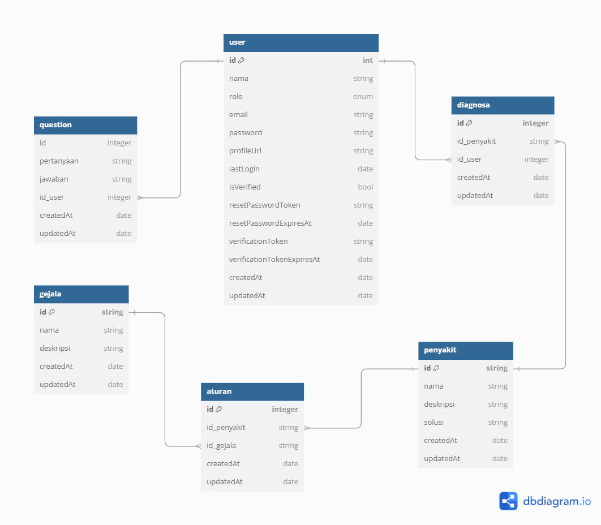

<<<<<<< HEAD

# Sistem Pakar Diagnosa Penyakit Gigi Dengan Metode Forward Chaining Berbasis WEB 

## Demo link: 🔗

Sistem ini telah di-deploy dan dapat diakses melalui:

- [prescripto](https://frontend-prescripto.vercel.app/)

## Table of Content: 📑

- [About The App](#about-the-app)
- [Screenshots](#screenshots)
- [Some Technologies that we use](#some-technologies-that-we-use)
- [Setup](#setup)

## About The App

Sistem Pakar Diagnosa Penyakit Gigi berbasis web ini menggunakan metode Forward Chaining untuk membantu pengguna dalam melakukan diagnosis awal penyakit gigi berdasarkan gejala yang dialami. Sistem ini dirancang untuk masyarakat umum, khususnya di daerah dengan akses terbatas ke layanan kesehatan gigi, dan menyediakan rekomendasi tindakan berdasarkan hasil diagnosis. Sebagai programmer utama dalam proyek ini, saya telah mengembangkan keseluruhan sistem, mulai dari backend hingga frontend

Fitur Utama:

- Diagnosa Penyakit Gigi: Pengguna dapat menginput gejala untuk mendapatkan hasil diagnosis otomatis.

- Konsultasi dengan Pakar: Fitur tanya jawab antara pengguna dan pakar gigi.

- Manajemen Data Pakar: Pakar dapat menambah, mengedit, atau menghapus data gejala dan penyakit dalam sistem.

- Riwayat Diagnosa: Pengguna dapat melihat riwayat hasil diagnosa sebelumnya.

- Role-Based Access Control: Mengamankan akses berbeda untuk pengguna (pasien) dan pakar.
  [Setup](#setup)

## Screenshots

- Database Diagram 📷
  

## Some Technologies that we use

          

## Setup

- setup and installation 💻
- download or clone the repository
- run `npm install`
- configurete env variable by env.example
- run `npm run db:create`
- run `npm run db:migrate`
- run `npm run db:seed`
- run `npm run dev`
- success run the server 🖥️
